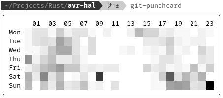
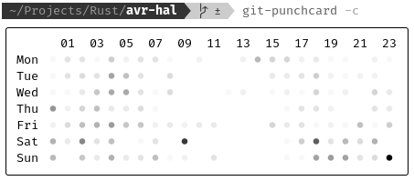

# Git Punchcard

I wanted a quick way to generate a punchcard for a git repository and came across
[`go-punchcard`](https://github.com/axiom/go-punchcard/tree/master).
Building this old `go` project seemed like a lot of hassle, so I wrote my own version in Rust.

## Usage

### Default design

```sh
cargo run
```



### Punchcard-like with circles

```sh
cargo run -- --circles
```



### Filter by author

Only selects a commit if the author name contains the given word.

```sh
cargo run -- --author=your_name
```
